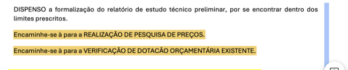

**1\. APÓS O DFD E ANTES DA ANÁLISE DE MERCADO (PESQUISA DE PREÇOS):**

Adicionar antes do encaminhamento para a pesquisa de preços:

“Encaminha-se à Autoridade Competente para AUTORIZAÇÃO DE CONTRATAÇÃO”

Corrigir os campos de encaminhamento para aparecer o nome do responsável pela REALIZAÇÃO DE PESQUISA DE PREÇOS e pela VERIFICAÇÃO DE DOTACÃO ORÇAMENTÁRIA EXISTENTE

ÓRGÃO/ENTIDADE: PREFEITURA MUNICIPAL DE XXXXXXXXXXXX

PROCESSO ADMINISTRATIVO: XXX

PROCESSO DE DISPENSA DE LICITAÇÃO: XXX

MODALIDADE E Nº DO PROCESSO ADMINISTRATIVO DA LICITAÇÃO ANTERIOR: XXX

**DESPACHO DE DECLARAÇÃO DE LICITAÇÃO FRACASSADA E AUTORIZAÇÃO DE CONTRATAÇÃO DIRETA POR DISPENSA**

**(Art. 75, Inciso III, c/c Art. 72 da Lei Federal nº 14.133/2021)**

**1\. RELATÓRIO**

1.1. Tratam os autos do Processo Administrativo nº \[Número do Processo fracassado\], instaurado com o objetivo de promover a licitação, na modalidade XXXXX, para \[descrever o objeto\], sob o regramento da Lei Federal nº 14.133/2021.

1.2. Realizada a sessão pública do XXXXXX nº XXX em XX de XXXX de XXXX \[Data da Sessão\], o(a) Pregoeiro(a)/Agente de Contratação, após a regular apreciação das propostas e/ou documentos de habilitação, atestou em Ata de Sessão e Relatório Final que a licitação restou FRACASSADA, tendo em vista que:

( ) Todas as propostas apresentadas foram desclassificadas por desconformidade com o Edital;

( ) Todos os licitantes habilitados/convocados foram inabilitados por descumprimento das exigências editalícias;

( ) Ocorreu a desclassificação e inabilitação de todos os licitantes participantes da disputa.

1.3. O relatório do certame foi devidamente instruído e submetido a esta Autoridade Competente, atestando o exaurimento da fase competitiva sem a obtenção de proposta apta à adjudicação, bem como a permanência da necessidade pública e do interesse da Administração na contratação do referido objeto.

**2\. FUNDAMENTAÇÃO E MOTIVAÇÃO**

2.1. O insucesso da disputa licitatória não afastou a necessidade premente do órgão no provimento do objeto contratual.

2.2. A Lei nº 14.133/2021 autoriza expressamente a contratação direta por Dispensa de Licitação quando a licitação anterior tiver restado fracassada há menos de 1 (um) ano, desde que mantidas integralmente as condições definidas no edital original e justificadas as razões do preço e da escolha do fornecedor, nos termos do seu Art. 75, inciso III:

“Art. 75\. É dispensável a licitação:

III \- para contratação que mantenha todas as condições definidas em edital de licitação realizada há menos de 1 (um) ano, quando se verificar que naquela licitação:

a) não surgiram licitantes interessados ou não foram apresentadas propostas válidas;”

2.3. Constata-se que o encerramento do certame anterior ocorreu dentro do prazo legal citado (há menos de 1 ano) e que o Estudo Técnico Preliminar (ETP) e o Termo de Referência/Projeto Básico originais permanecem adequados, vigentes e aptos para reger a contratação direta.

**3\. DA DEMONSTRAÇÃO DO PREJUÍZO À ADMINISTRAÇÃO E DA INVIABILIDADE DE NOVO CERTAME**

A opção da Administração em prosseguir via Dispensa de Licitação, em detrimento da deflagração de uma nova licitação tradicional, fundamenta-se nos seguintes fatores imperativos:

a) Risco de Descontinuidade e Prejuízo ao Interesse Público

* A realização de um novo processo licitatório (elaboração de novas fases, publicação de edital, prazos mínimos de apresentação de propostas, sessão pública, fases recursais e homologação) consumiria um período estimado entre 60 a 90 dias úteis.  
* A aguarda por esse interregno temporal causará prejuízo direto e irreparável à Administração, resultando em paralisação de serviços essenciais.

b) Ineficiência e Custos Administrativos Repetitivos

* A repetição integral do rito do processo licitatório fracassado acarretaria a mobilização desnecessária da equipe da Comissão de Licitação, assessoria jurídica e setores técnicos, gerando custos operacionais e administrativos que afrontam o Princípio da Eficiência (Art. 37, caput, CF/88) e o Princípio da Economia Processual (Art. 5º da Lei nº 14.133/2021).  
* Não há garantia ou indicador de que a reabertura do certame nos mesmos moldes atrairia resultado diverso no curto prazo, onerando a máquina pública sem ganho efetivo de competitividade.

c) Celeridade e Efetividade da Contratação Direta

* O procedimento de dispensa por licitação fracassada permite à Administração buscar no mercado fornecedores capacitados que aceitem executar o objeto nas exatas condições estipuladas no edital original, assegurando o atendimento tempestivo da necessidade pública.

**4\. DECISÃO E DETERMINAÇÕES**

Diante do exposto, no uso das atribuições legais a mim conferidas, DECIDO:

1. DECLARAR FORMALMENTE FRACASSADO o processo licitatório na modalidade XXXXXX nº XXX, Processo Administrativo nº XXX.  
2. CERTIFICAR E ATESTAR, para os devidos fins de instrução do Processo de Dispensa de Licitação nº XXX, o fracasso da licitação anterior, servindo o presente despacho como documento comprobatório exigido pela legislação vigente.  
3. AUTORIZAR O REAPROVEITAMENTO INTEGRAL dos Estudos Técnicos Preliminares (ETP) e do Termo de Referência/Projeto Básico do certame fracassado, ficando expressamente vedada qualquer alteração nas especificações do objeto, quantitativos, prazos, locais de entrega e condições de habilitação ou pagamento estabelecidas no edital originário.  
4. DETERMINAR A INSTAURAÇÃO E INSTRUÇÃO DA DISPENSA DE LICITAÇÃO com fulcro no Art. 75, inciso III, da Lei nº 14.133/2021, devendo a unidade técnica adotar as seguintes providências:  
1) Anexar cópia integral da Ata do Certame Fracassado e do presente Despacho aos autos da Dispensa;  
2) Realizar a cotação/pesquisa de preços atualizada no mercado ou contatar fornecedores atuantes no ramo para verificação de aceitação das condições do edital original por preço igual ou inferior ao estimado no certame;  
3) Proceder à verificação da documentação de habilitação jurídica, fiscal, trabalhista e qualificação técnica do fornecedor selecionado, em estrita conformidade com os critérios fixados no edital original;  
4) Encaminhar os autos à Assessoria Jurídica para emissão do parecer opinativo nos termos do Art. 72 da Lei nº 14.133/2021.  
     
   XXXXXXXXXX – PI, XX de XXXX de XXXX.  
     
     
     
   

\_\_\_\_\_\_\_\_\_\_\_\_\_\_\_\_\_\_\_\_\_\_\_\_\_\_\_\_\_\_\_\_\_\_\_\_\_\_\_\_\_\_  
XXXXXXXXXXXXXXXXXX  
Prefeito Municipal

* Adicionar campo para anexar a Ata da Sessão da licitação fracassada

3\. \[ADICIONAR CAMPO APÓS O TERMO DE REFERÊNCIA/PROJETO BÁSICO\]

**DECLARAÇÃO DE MANUTENÇÃO DAS CONDIÇÕES EDITALÍCIAS**

(Art. 75, Inciso III, da Lei Federal nº 14.133/2021)

PROCESSO ADMINISTRATIVO: XXX

PROCESSO DE DISPENSA DE LICITAÇÃO: XXX

MODALIDADE E Nº DO PROCESSO ADMINISTRATIVO DA LICITAÇÃO ANTERIOR: XXX

SETOR REQUISITANTE: XXXXXXXXXX

DECLARO, para os devidos fins de instrução do processo de contratação direta por Dispensa de Licitação, com fundamento no Art. 75, inciso III, alínea "a", da Lei nº 14.133/2021, que:

1. As especificações técnicas, quantitativos, prazos de entrega/execução, locais de prestação, obrigações da contratada e condições de pagamento constantes da proposta a ser contratada mantêm ESTRITA E INTEGRAL IDENTIDADE com as condições fixadas no Edital e no Termo de Referência/Projeto Básico do XXXXX nº XXX \[LICITAÇÃO FRACASSADA\], restado fracassado em XX de XXXX de XXXX.  
2. As exigências relativas à qualificação técnica, jurídica, fiscal, social e trabalhista exigidas do fornecedor a ser contratado obedecem rigorosamente aos mesmos critérios estabelecidos no instrumento convocatório da licitação anterior.  
3. Não foi realizada qualquer alteração, redução ou ampliação nos requisitos do objeto ou nas cláusulas contratuais que pudessem descaracterizar as condições originais submetidas à disputa pública.  
4. O valor a ser contratado é compatível com a estimativa de preço praticada no certame anterior e com os valores de mercado atualizados.

Por ser a expressão da verdade, firmo a presente declaração para que produza seus efeitos legais e instrua o respectivo processo administrativo.

XXXXXXXX – PI, XX de XXXX de 2026.

\_\_\_\_\_\_\_\_\_\_\_\_\_\_\_\_\_\_\_\_\_\_\_\_\_\_\_\_\_\_\_\_\_\_\_\_\_\_\_\_\_\_  
XXXXXXXXXXXXXXXXXX  
Agente de Contratação

4\. NO ATOS DA SESSÃO

Substituir a “JUSTIFICATIVA DA CONTRATAÇÃO “para o seguinte texto:

**JUSTIFICATIVA DA CONTRATAÇÃO**

O objeto da presente contratação foi submetido a certame licitatório regular por meio do XXXXX nº XXX \[LICITAÇÃO FRACASSADA\], contudo, o certame restou FRACASSADO, conforme documentação acostada aos autos.

A opção pela contratação direta por Dispensa de Licitação, embasada no Art. 75, III, alínea "a", da Lei nº 14.133/2021, justifica-se pela subsistência da necessidade pública e pela inviabilidade temporal e econômica de realização de novo certame licitatório, o qual acarretaria grave prejuízo à continuidade dos serviços públicos e custos administrativos repetitivos sem garantia de resultado diverso.

Atesta-se que a presente dispensa cumpre os requisitos legais exigidos quanto a temporalidade e manutenção das condições definidas no processo licitatório fracassado.

A dispensa de Licitação se dá pela grade necessidade XXXXXXXX \[OBJETO\].

A contratação atende as normas legais, onde a contratação da empresa dar-se-á devido a mesma ter apresentado menor preço dentre aquelas que apresentaram propostas para o objeto.

Nota-se que o valor da futura contratação está dentro do limite previsto em lei, com isto, objetiva-se atender aos princípios da legalidade, economicidade e celeridade, na realização da presente contratação.

5\. NO PARECER JURÍDICO

Substituir toda a minuta do parecer jurídico pela minuta abaixo:

**PARECER JURÍDICO**

Interessado: XXXXXXXX

Assunto: Contratação Direta por Dispensa de Licitação — Licitação Anterior Fracassada (Art. 75, III, "a", da Lei nº 14.133/2021)

**EMENTA: DIREITO ADMINISTRATIVO. LICITAÇÕES E CONTRATOS. NOVA LEI DE LICITAÇÕES (LEI Nº 14.133/2021). DISPENSA DE LICITAÇÃO (ART. 75, INCISO III, ALÍNEA "A"). LICITAÇÃO ANTERIOR FRACASSADA. TEMPORALIDADE INFERIOR A 1 (UM) ANO. MANUTENÇÃO INTEGRAL DAS CONDIÇÕES EDITALÍCIAS ORIGINAIS. JUSTIFICATIVA DE PREJUÍZO E INVIABILIDADE DE NOVO CERTAME. COMPROVAÇÃO DE PREÇO E HABILITAÇÃO DO FORNECEDOR. CUMPRIMENTO DOS REQUISITOS DO ART. 72 DA LEI Nº 14.133/2021. POSSIBILIDADE JURÍDICA. PARECER FAVORÁVEL À CONTRATAÇÃO.**

1\. RELATÓRIO

Vêm a esta Assessoria Jurídica, para emissão de parecer opinativo nos termos do Art. 72, da Lei Federal nº 14.133/2021, os autos do Processo Administrativo em epígrafe, que versa sobre a contratação direta por Dispensa de Licitação de empresa especializada para XXXXXXXX \[OBJETO\].

Consta dos autos que a Administração Pública promoveu anteriormente o XXXXX nº XXX \[LICITAÇÃO FRACASSADA\], cujo objeto restou FRACASSADO, consoante Ata de Sessão Pública e Despacho Homologatório da Autoridade Competente.

Diante da permanência da necessidade pública e do risco de prejuízo/descontinuidade dos serviços administrativos, o Setor Requisitante instaurou o presente procedimento de Dispensa de Licitação fundamentado no Art. 75, inciso III, alínea "a", da Lei nº 14.133/2021, instruindo o feito com:

* Despacho da Autoridade Competente declarando formalmente o fracasso do certame anterior;  
* Declaração atestando a estrita e integral manutenção das condições fixadas no edital original;  
* Justificativa da inviabilidade e do prejuízo em realizar novo certame licitatório;  
* Termo de Referência (TR) revalidados;  
* Pesquisa de mercado e justificativa da adequação do preço contratado;  
* Documentação de habilitação jurídica, fiscal, trabalhista e qualificação técnica do vencedor;  
* Declaração de disponibilidade e reserva orçamentária;  
* Minuta do Contrato.

É o relatório. Passo à fundamentação jurídica.

2\. FUNDAMENTAÇÃO JURÍDICA

2.1. Da Hipótese de Dispensa por Certame Fracassado (Art. 75, III, "a")

A Constituição Federal estabelece, como regra geral, a obrigatoriedade de licitar (Art. 37, XXI). Contudo, a própria Carta Magna ressalva os casos especificados na legislação infraconstitucional.

No âmbito da Nova Lei de Licitações (Lei nº 14.133/2021), o Art. 75, inciso III, alínea "a", prevê hipótese de dispensa de licitação para contratações cujo certame originário restou infrutífero:

“Art. 75\. É dispensável a licitação:

III \- para contratação que mantenha todas as condições definidas em edital de licitação realizada há menos de 1 (um) ano, quando se verificar que naquela licitação:

a) não surgiram licitantes interessados ou não foram apresentadas propostas válidas;”

Para a correta aplicação do dispositivo legal, a doutrina e a jurisprudência fixam quatro requisitos cumulativos:

1. Ocorrência prévia de licitação fracassada;  
2. Temporalidade inferior a 1 (um) ano entre a realização da licitação e a contratação direta;  
3. Manutenção irrestrita das condições constantes do edital originário;  
4. Justificativa do preço e da escolha do fornecedor.

2.2. Da Análise do Preenchimento dos Requisitos do Caso Concreto

a) Do Fracasso Anterior e Temporalidade: Compulsa-se dos autos que o XXXXX nº XXX \[LICITAÇÃO FRACASSADA\] teve sua sessão pública realizada em XX de XXXX de XXXX. Restando fracassado em XX de XXXX de XXXX, constata-se que não decorreu o prazo de 1 (um) ano exigido no dispositivo legal, estando plenamente preenchido o requisito temporal.

b) Da Manutenção das Condições Editalícias: A instrução conta com DECLARAÇÃO DE MANUTENÇÃO DAS CONDIÇÕES EDITALÍCIAS atestando que as especificações técnicas, quantitativos, prazos, critérios de habilitação e obrigações contratuais são rigorosamente idênticos aos previstos no instrumento convocatório anterior. Não houve qualquer flexibilização ou alteração capaz de descaracterizar o objeto ou beneficiar indevidamente a futura contratada.

c) Da Justificativa de Prejuízo e Inviabilidade de Novo Certame: A Autoridade Competente apresentou justificativa fundamentada demonstrando que a deflagração de um novo processo licitatório demandaria prazos incompatíveis com a urgência da demanda, gerando custos operacionais repetitivos e risco de descontinuidade do serviço público, restando atendido o Princípio da Eficiência (Art. 37, caput, CF/88).

2.3. Da Instrução Processual de Acordo com o Art. 72 da Lei nº 14.133/2021

O processo administrativo da contratação direta deve observar os requisitos formais estipulados no Art. 72 da Lei nº 14.133/2021. Verifica-se o atendimento dos seguintes itens nos autos:

I \- ETP, TR ou Projeto Básico: Termo de Referência/Projeto Básico mantidos do edital original

II \- Estimativa de Despesa: Pesquisa de mercado e planilha orçamentária atualizada

III \- Parecer Jurídico: O presente documento opinativo

IV \- Disponibilidade Orçamentária: Declaração da dotação e reserva orçamentária

V \- Comprovação de Habilitação: Certidões fiscais, trabalhistas, jurídicas e qualificações

VI \- Razão da Escolha e do Preço: Justificativa técnica atestando compatibilidade com o mercado

VII \- Autorização da Autoridade: Despacho da Autoridade Competente

2.4. Da Razoabilidade do Preço Contratado

A empresa a ser contratada apresentou proposta dentro do limite estimado e em consonância com a pesquisa mercadológica atualizada encartada aos autos, afastando qualquer hipótese de sobrepreço ou superfaturamento.

3\. CONCLUSÃO E RECOMENDAÇÕES

Face ao exposto, com fundamento no Art. 75, inciso III, alínea "a", c/c o Art. 72 da Lei Federal nº 14.133/2021, esta Assessoria Jurídica opina pela POSSIBILIDADE JURÍDICA do prosseguimento da contratação direta por Dispensa de Licitação, devendo ser observadas as seguintes recomendações antes da assinatura do contrato:

1. Certidões Negativas: Verificar a manutenção da validade de todas as certidões de regularidade fiscal, social e trabalhista da empresa no ato da assinatura do contrato;  
2. Ato de Autorização e Ratificação: Submeter os autos à Autoridade Competente para ato formal de autorização e adjudicação da dispensa, conforme exige o Art. 72, VIII, da NLLC;  
3. Publicidade Obrigatória: Garantir a publicação do extrato do contrato e do ato de dispensa no Portal Nacional de Contratações Públicas (PNCP), no prazo máximo de 10 (dez) dias úteis contados da assinatura do contrato, como condição indispensável para sua eficácia.

É o parecer, de caráter opinativo, que submeto à consideração superior.

XXXXXXXX – PI, XX de XXXX de 2026.

\_\_\_\_\_\_\_\_\_\_\_\_\_\_\_\_\_\_\_\_\_\_\_\_\_\_\_\_\_\_\_\_\_\_\_\_\_\_\_\_\_\_  
XXXXXXXXXXXXXXXXXX