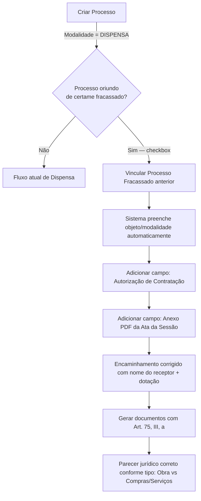

# Plano de Implementação — Dispensa por Processo Fracassado
## Art. 75, Inciso III, Alínea A — Lei Federal nº 14.133/2021

> [!IMPORTANT]
> Prazo acordado em reunião: **próxima segunda-feira (2026-08-03)**. Todas as tarefas abaixo devem estar concluídas até essa data.

---

## Contexto Legal

O **Art. 75, Inciso III, alínea "a"** da Lei 14.133/2021 autoriza a dispensa de licitação quando um certame anterior (pregão eletrônico, concorrência, etc.) fracassa por ausência de propostas válidas. O sistema já possui um fluxo completo de **Dispensa** (Art. 75, Inc. II — obras; e compras/serviços genéricos), mas **não contempla** a variante de processo fracassado. A decisão da reunião foi **reutilizar** a estrutura existente de dispensa, adicionando campos e ajustes pontuais, em vez de criar um módulo isolado.

---

## Visão Geral da Solução



---

## Tarefas de Implementação

### TAREFA 1 — Banco de Dados: Novos Campos
**Arquivo:** nova migration `2026_07_28_XXXXXX_add_dispensa_fracassado_fields.php`

Adicionar na tabela `processo_detalhes`:

| Campo | Tipo | Descrição |
|---|---|---|
| `processo_fracassado_id` | `unsignedBigInteger nullable` | FK → `processos.id` do certame fracassado |
| `is_oriundo_fracassado` | `boolean default false` | Flag: processo vem de certame fracassado |
| `autorizacao_contratacao` | `text nullable` | Texto do documento de autorização de contratação |
| `anexo_pdf_ata_sessao_fracassada` | `string nullable` | Caminho do PDF da ata da sessão fracassada |

> [!NOTE]
> O campo `processo_fracassado_id` permite buscar automaticamente objeto e modalidade do processo anterior, mas o sistema deve permitir edição manual se não houver vínculo.

---

### TAREFA 2 — Model: `ProcessoDetalhe.php`

Adicionar ao `$fillable`:
```php
'is_oriundo_fracassado',
'processo_fracassado_id',
'autorizacao_contratacao',
'anexo_pdf_ata_sessao_fracassada',
```

Adicionar cast:
```php
'is_oriundo_fracassado' => 'boolean',
```

Adicionar relacionamento:
```php
public function processoFracassado()
{
    return $this->belongsTo(Processo::class, 'processo_fracassado_id');
}
```

---

### TAREFA 3 — View: `create.blade.php` — Tela de Criação de Processo

Quando a modalidade selecionada for **DISPENSA (value = 2)**, exibir um bloco adicional com:

1. **Checkbox** `is_oriundo_fracassado` — *"Este processo é oriundo de um certame fracassado (Art. 75, III, a)?"*
2. **Select de processo fracassado** — aparece ao marcar o checkbox. Carrega via AJAX a lista de processos da mesma prefeitura com status `FINALIZADO` ou `CANCELADO` por fracasso. Ao selecionar:
   - Preenche automaticamente o campo **Objeto** com o objeto do processo anterior
   - Define o **Tipo de Procedimento** automaticamente (COMPRAS / SERVIÇOS / OBRA)

```html
{{-- Dentro do bloco @if modalidade === 2 (JS toggle) --}}
<div id="bloco_fracassado" class="md:col-span-2 hidden">
    <label class="flex items-center gap-3 p-4 border border-amber-200 bg-amber-50 rounded-lg cursor-pointer">
        <input type="checkbox" name="is_oriundo_fracassado" id="is_oriundo_fracassado" value="1">
        <span class="text-sm font-medium text-amber-800">
            ⚠️ Este processo é oriundo de um certame fracassado (Art. 75, Inciso III, alínea a da Lei 14.133/2021)
        </span>
    </label>

    <div id="select_processo_fracassado" class="mt-3 hidden">
        <label class="block text-sm font-medium text-gray-700">Processo Fracassado (Origem)</label>
        <select name="processo_fracassado_id" id="processo_fracassado_id" class="...">
            <option value="">Selecione o processo fracassado...</option>
        </select>
        <p class="text-xs text-gray-500 mt-1">
            Ao vincular, o objeto e tipo serão preenchidos automaticamente.
        </p>
    </div>
</div>
```

---

### TAREFA 4 — Controller: `ProcessoController.php`

No método `store()`, tratar os novos campos:
```php
// Se oriundo de fracassado, herdar dados do processo anterior
if ($request->is_oriundo_fracassado && $request->processo_fracassado_id) {
    $processoOrigem = Processo::find($request->processo_fracassado_id);
    // Preencher objeto se não informado manualmente
    if (empty($request->objeto) && $processoOrigem) {
        $validated['objeto'] = $processoOrigem->objeto;
        $validated['tipo_procedimento'] = $processoOrigem->tipo_procedimento?->value;
    }
}
```

Salvar no `processo_detalhes` após criar o processo:
```php
$processo->detalhe()->updateOrCreate(
    ['processo_id' => $processo->id],
    [
        'is_oriundo_fracassado'   => $request->boolean('is_oriundo_fracassado'),
        'processo_fracassado_id'  => $request->processo_fracassado_id,
    ]
);
```

Adicionar rota AJAX para buscar processos fracassados disponíveis:
```
GET /admin/processos/fracassados?prefeitura_id={id}
→ retorna lista de processos com status FINALIZADO/CANCELADO (não-DISPENSA)
```

---

### TAREFA 5 — View: `iniciar.blade.php` — Campos na Aba de Dispensa

Adicionar **entre** o documento de "Formalização de Demanda" e "Análise de Mercado":

#### 5.1 — Campo: Autorização de Contratação
Novo item no array `$documentos` do controller (ou como campo no accordion da Formalização):
```php
'autorizacao_contratacao' => 'Campo de autorização de contratação para processo fracassado'
```
Exibido **somente** quando `$processo->detalhe->is_oriundo_fracassado === true`.

#### 5.2 — Campo: Anexo PDF da Ata da Sessão Fracassada
Campo de upload de arquivo PDF, exibido somente nos processos oriundos de certames fracassados:
```php
// No forms.blade.php
@elseif($campo === 'anexo_pdf_ata_sessao_fracassada' && $processo->detalhe?->is_oriundo_fracassado)
<x-form-field name="anexo_pdf_ata_sessao_fracassada"
              label="📎 Anexar PDF da Ata da Sessão Fracassada"
              type="file" accept="application/pdf" />
```

#### 5.3 — Indicador visual no header do processo
Exibir badge/alerta no `processo-header.blade.php` quando for processo fracassado:
```html
@if($processo->detalhe?->is_oriundo_fracassado)
<span class="inline-flex items-center gap-1 px-3 py-1 text-xs font-bold text-amber-800 bg-amber-100 border border-amber-300 rounded-full">
    ⚖️ Art. 75, III, a — Processo Fracassado
</span>
@endif
```

---

### TAREFA 6 — Corrigir Encaminhamento para Pesquisa de Preço

**Arquivo:** `resources/views/Admin/Processos/pdf/dispensa/compras_lote/formalizacao.blade.php`
e equivalente para obras.

**Problema:** Nome do receptor e dotação orçamentária não aparecem automaticamente.

**Correção:**
```blade
{{-- Encaminhamento Pesquisa de Preço --}}
{{ $processo->detalhe->encaminhamento_pesquisa_preco ?? '[NOME DO DESTINATÁRIO]' }}

{{-- Dotação Orçamentária --}}
{{ $processo->detalhe->dotacao_orcamentaria ?? '[DOTAÇÃO ORÇAMENTÁRIA]' }}

{{-- Órgão/Entidade → padronizar como "Prefeitura Municipal de {cidade}" --}}
Prefeitura Municipal de {{ $processo->prefeitura->cidade }}
```

Buscar todas as ocorrências que referenciam `orgao_responsavel` nos PDFs de dispensa e verificar se estão populados; quando vazio, usar o padrão "Prefeitura Municipal de {cidade}".

---

### TAREFA 7 — Atualizar Referências Legais nos Documentos

**Escopo:** todos os arquivos em `resources/views/Admin/Processos/pdf/dispensa/` que contenham "Art. 75, Inc. II" ou "Art. 75, Inciso II".

**Para processos fracassados (is_oriundo_fracassado = true), usar:**
> Art. 75, Inciso III, alínea "a" da Lei Federal nº 14.133/2021

**Implementação:** Criar variável de contexto no controller:
```php
$fundamentoLegal = $processo->detalhe?->is_oriundo_fracassado
    ? 'Art. 75, Inciso III, alínea "a" da Lei Federal nº 14.133/2021'
    : 'Art. 75, Inciso II da Lei Federal nº 14.133/2021'; // obras
    // ou: 'Art. 75, Inciso I da Lei Federal nº 14.133/2021'; // compras/serviços
```

Passar `$fundamentoLegal` para todas as views de PDF de dispensa e substituir as referências hardcoded.

---

### TAREFA 8 — Parecer Jurídico Dinâmico por Modalidade

**Conforme solicitado por Fred de Oliveira Roldão:** o parecer jurídico deve ser **diferente** para Obras vs Compras/Serviços.

**Implementação:**

No controller que gera o PDF `parecer_juridico` para dispensa:
```php
$viewParecer = match(true) {
    $processo->tipo_procedimento === TipoProcedimentoEnum::OBRA
        => 'Admin.Processos.pdf.dispensa.obra.parecer_juridico',
    default
        => 'Admin.Processos.pdf.dispensa.compras_lote.parecer_juridico',
        // (inclui servicos_lote)
};
```

Para processos fracassados, o parecer deve mencionar o Art. 75, III, a e incluir referência ao certame anterior:
- Número do processo fracassado anterior
- Modalidade do certame fracassado (Pregão Eletrônico / Concorrência)
- Data do fracasso (campo a adicionar ou extrair da ata)

---

## Ordem de Execução Sugerida

| # | Tarefa | Prioridade | Esforço Est. |
|---|---|---|---|
| 1 | Migration — novos campos | 🔴 Alta | 30 min |
| 2 | Model ProcessoDetalhe | 🔴 Alta | 15 min |
| 3 | View create.blade.php + AJAX | 🔴 Alta | 2–3 h |
| 4 | Controller store() | 🔴 Alta | 1 h |
| 5 | View iniciar.blade.php (campos) | 🟡 Média | 2 h |
| 6 | Corrigir encaminhamento PDFs | 🟡 Média | 1 h |
| 7 | Atualizar referências legais (Art. 75) | 🟡 Média | 1–2 h |
| 8 | Parecer jurídico dinâmico | 🟠 Depende do João Victor | 1–2 h |

---

## Arquivos Afetados (Mapa)

```
database/migrations/
  └── 2026_07_28_XXXXXX_add_dispensa_fracassado_fields.php      [NOVO]

app/Models/
  └── ProcessoDetalhe.php                                         [EDITAR]

app/Http/Controllers/
  └── ProcessoController.php                                      [EDITAR]

resources/views/Admin/Processos/
  ├── create.blade.php                                            [EDITAR]
  ├── iniciar.blade.php                                           [EDITAR]
  ├── partials/
  │   ├── forms.blade.php                                         [EDITAR]
  │   └── processo-header.blade.php                               [EDITAR]
  └── pdf/dispensa/
      ├── compras_lote/formalizacao.blade.php                     [EDITAR]
      ├── compras_lote/parecer_juridico.blade.php                 [EDITAR]
      ├── servicos_lote/formalizacao.blade.php                    [EDITAR]
      ├── servicos_lote/parecer_juridico.blade.php                [EDITAR]
      ├── obra/formalizacao.blade.php                             [EDITAR]
      └── obra/parecer_juridico.blade.php                         [EDITAR]
```

---

## Pendências Externas

> [!WARNING]
> - **João Victor Oliveira** deve enviar os arquivos com modelos atualizados e lista de alterações antes do início da Tarefa 8 (Pareceres Jurídicos).
> - Confirmar se a dispensa por fracassado se aplica também a **obras** (além de compras/serviços) — a reunião mencionou "possibilidade de extensão".

---

## Notas Técnicas

- **Não criar novo processo separado:** tudo se resolve na modalidade `DISPENSA` existente, com o flag `is_oriundo_fracassado`.
- **Pesquisa de preço deve ser mantida** (Fred confirmou que não se descarta a pesquisa de preço nesses casos).
- **Edição manual permitida:** mesmo com vínculo ao processo fracassado, o usuário deve poder editar objeto e tipo.
- **Declaração de manutenção das condições editalícias:** o gráfico visual complexo foi removido (decisão da reunião). Usar texto simples.
